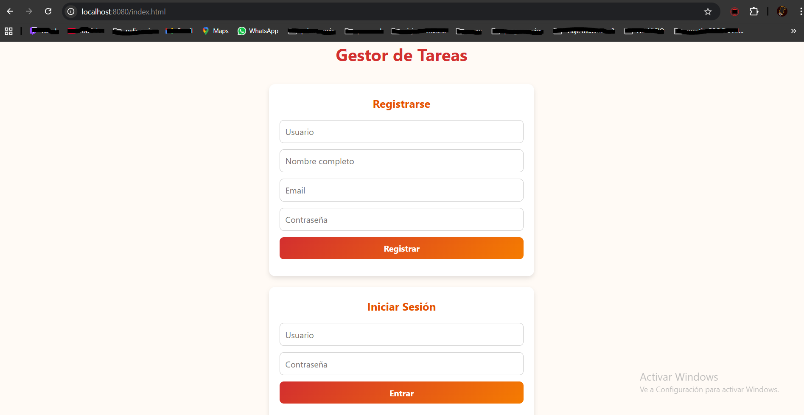
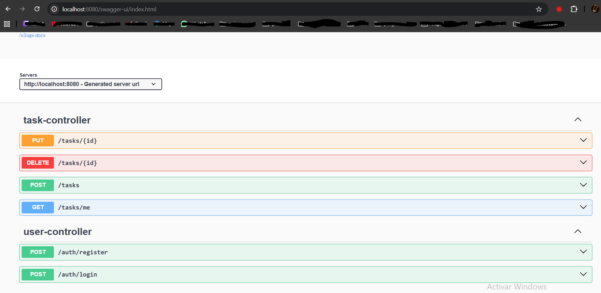
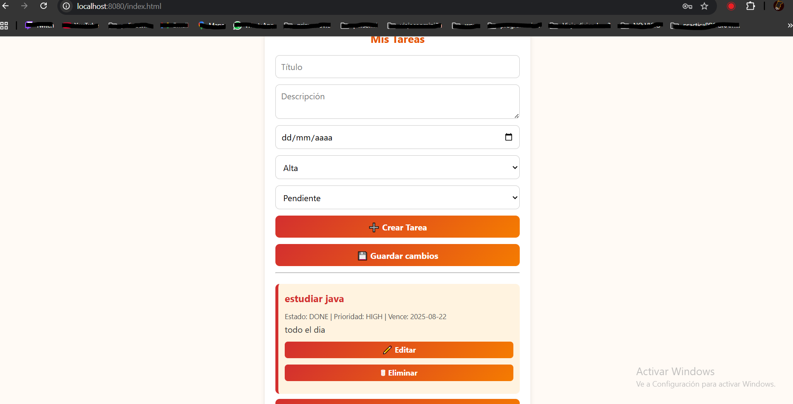

# 📝 Gestor de Tareas (Spring Boot + JWT + HTML/CSS/JS)

Aplicación **fullstack** de gestión de tareas donde los usuarios pueden registrarse, iniciar sesión y administrar sus tareas (crear, actualizar, eliminar, listar).  
La autenticación se realiza con **JWT** y el backend expone su API documentada con **Swagger**.

---

## 🚀 Tecnologías utilizadas

### 🔹 Backend
- Java 17
- Spring Boot 3 (Web, Security, JPA, Validation)
- JWT (JSON Web Token)
- Base de datos (MySQL)
- Swagger / OpenAPI 3

### 🔹 Frontend
- HTML5 + CSS3 (paleta en tonos rojos, naranjas y blancos)
- JavaScript (fetch API + manipulación del DOM)

### 🔹 Testing
- JUnit 5
- Mockito
- Spring Boot Test

---

## 📸 Capturas de pantalla

Login

Gestion tareas

Swagger

---

## ⚙️ Instalación y ejecución

🔧 Opción 1: Ejecución local (sin Docker)

1. Clonar el repositorio
git clone https://github.com/tuusuario/gestor-tareas.git

2. BBDD
Configurar Base de Datos MySQL Asegúrate de tener MySQL instalado y en funcionamiento. Luego, configura las credenciales en el archivo: src/main/resources/application.properties

3. Ejecutar la aplicacion
Ejecutar la Aplicación Puedes usar tu IDE (como IntelliJ o Visual Studio Code) o desde consola. Asegúrate de tener Maven instalado

4. Documentacion con swagger
Acceder a Swagger (Documentación API) Para revisar la documentación, una vez en marcha, accede a:

http://localhost:8080/swagger-ui.html

🐳 Opción 2: Ejecución con Docker (recomendada)

El proyecto ya incluye un archivo docker-compose.yml que levanta tanto la base de datos MySQL como la aplicación Spring Boot.

1. Levantar contenedores

docker-compose up -d

2. Ver logs de la aplicación

docker logs -f tareas-app

3. Acceder a la aplicación

Frontend: http://localhost:8080

Swagger: http://localhost:8080/swagger-ui.html
